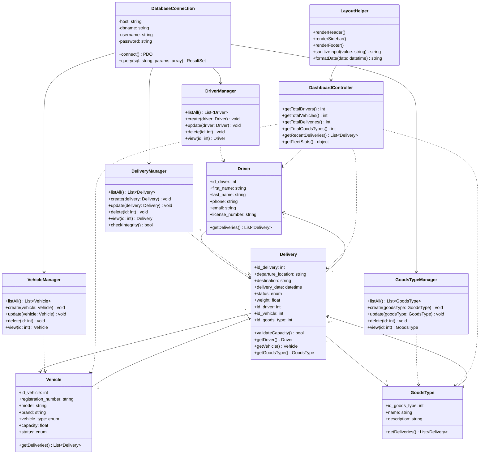

# Fleet Management System - Class Diagram (Full)

```mermaid
classDiagram
    class DatabaseConnection {
        -host: string
        -dbname: string
        -username: string
        -password: string
        +connect() PDO
        +query(sql: string, params: array) ResultSet
    }

    class Driver {
        +id_driver: int
        +first_name: string
        +last_name: string
        +phone: string
        +email: string
        +license_number: string
        +getDeliveries() List~Delivery~
    }

    class Vehicle {
        +id_vehicle: int
        +registration_number: string
        +model: string
        +brand: string
        +vehicle_type: enum
        +capacity: float
        +status: enum
        +getDeliveries() List~Delivery~
    }

    class GoodsType {
        +id_goods_type: int
        +name: string
        +description: string
        +getDeliveries() List~Delivery~
    }

    class Delivery {
        +id_delivery: int
        +departure_location: string
        +destination: string
        +delivery_date: datetime
        +status: enum
        +weight: float
        +id_driver: int
        +id_vehicle: int
        +id_goods_type: int
        +validateCapacity() bool
        +getDriver() Driver
        +getVehicle() Vehicle
        +getGoodsType() GoodsType
    }

    class DriverManager {
        +listAll() List~Driver~
        +create(driver: Driver) void
        +update(driver: Driver) void
        +delete(id: int) void
        +view(id: int) Driver
    }

    class VehicleManager {
        +listAll() List~Vehicle~
        +create(vehicle: Vehicle) void
        +update(vehicle: Vehicle) void
        +delete(id: int) void
        +view(id: int) Vehicle
    }

    class GoodsTypeManager {
        +listAll() List~GoodsType~
        +create(goodsType: GoodsType) void
        +update(goodsType: GoodsType) void
        +delete(id: int) void
        +view(id: int) GoodsType
    }

    class DeliveryManager {
        +listAll() List~Delivery~
        +create(delivery: Delivery) void
        +update(delivery: Delivery) void
        +delete(id: int) void
        +view(id: int) Delivery
        +checkIntegrity() bool
    }

    class DashboardController {
        +getTotalDrivers() int
        +getTotalVehicles() int
        +getTotalDeliveries() int
        +getTotalGoodsTypes() int
        +getRecentDeliveries() List~Delivery~
        +getFleetStats() object
    }

    class LayoutHelper {
        +renderHeader()
        +renderSidebar()
        +renderFooter()
        +sanitizeInput(value: string) string
        +formatDate(date: datetime) string
    }

    Driver "1" --> "0..*" Delivery
    Vehicle "1" --> "0..*" Delivery
    GoodsType "1" --> "0..*" Delivery

    Delivery "*" --> "1" Driver
    Delivery "*" --> "1" Vehicle
    Delivery "*" --> "1" GoodsType

    DriverManager ..> Driver
    VehicleManager ..> Vehicle
    GoodsTypeManager ..> GoodsType
    DeliveryManager ..> Delivery

    DashboardController ..> Driver
    DashboardController ..> Vehicle
    DashboardController ..> GoodsType
    DashboardController ..> Delivery

    DatabaseConnection --> DriverManager
    DatabaseConnection --> VehicleManager
    DatabaseConnection --> GoodsTypeManager
    DatabaseConnection --> DeliveryManager
    LayoutHelper --> DashboardController
```
