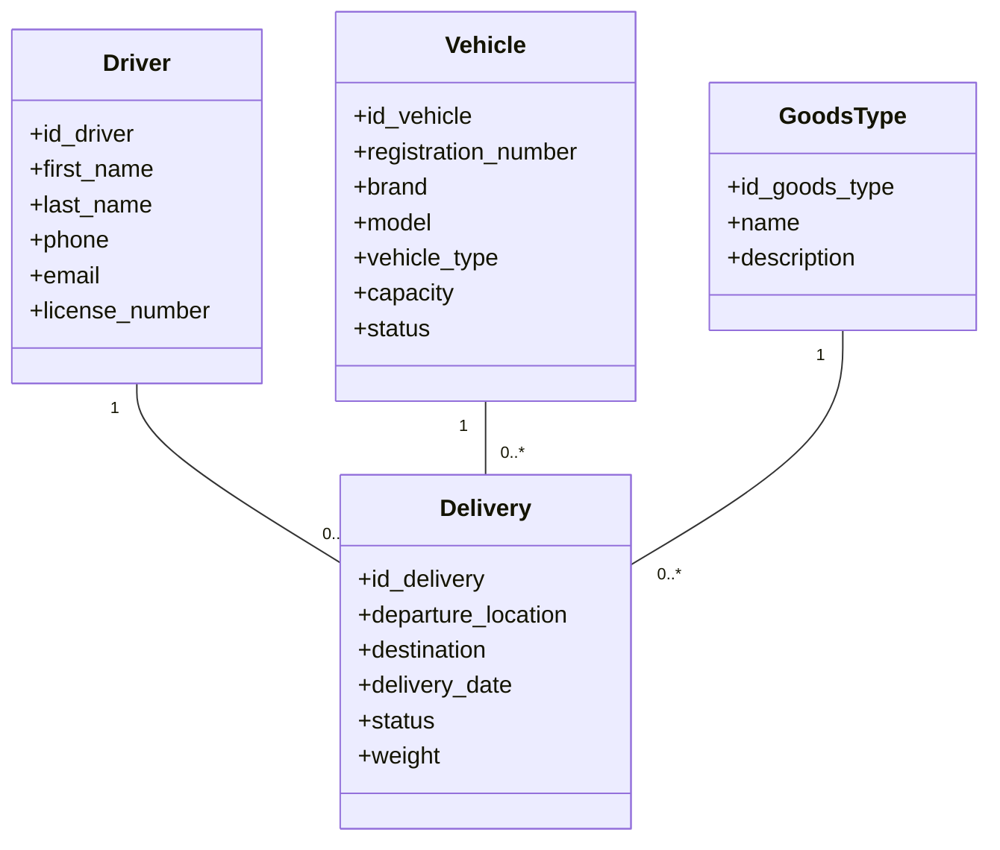

# Fleet Management System - Class Diagram (Simple)

```mermaid
classDiagram
    class Driver {
        +id_driver
        +first_name
        +last_name
        +phone
        +email
        +license_number
    }

    class Vehicle {
        +id_vehicle
        +registration_number
        +brand
        +model
        +vehicle_type
        +capacity
        +status
    }

    class GoodsType {
        +id_goods_type
        +name
        +description
    }

    class Delivery {
        +id_delivery
        +departure_location
        +destination
        +delivery_date
        +status
        +weight
    }

    Driver "1" -- "0..*" Delivery
    Vehicle "1" -- "0..*" Delivery
    GoodsType "1" -- "0..*" Delivery
``` 
